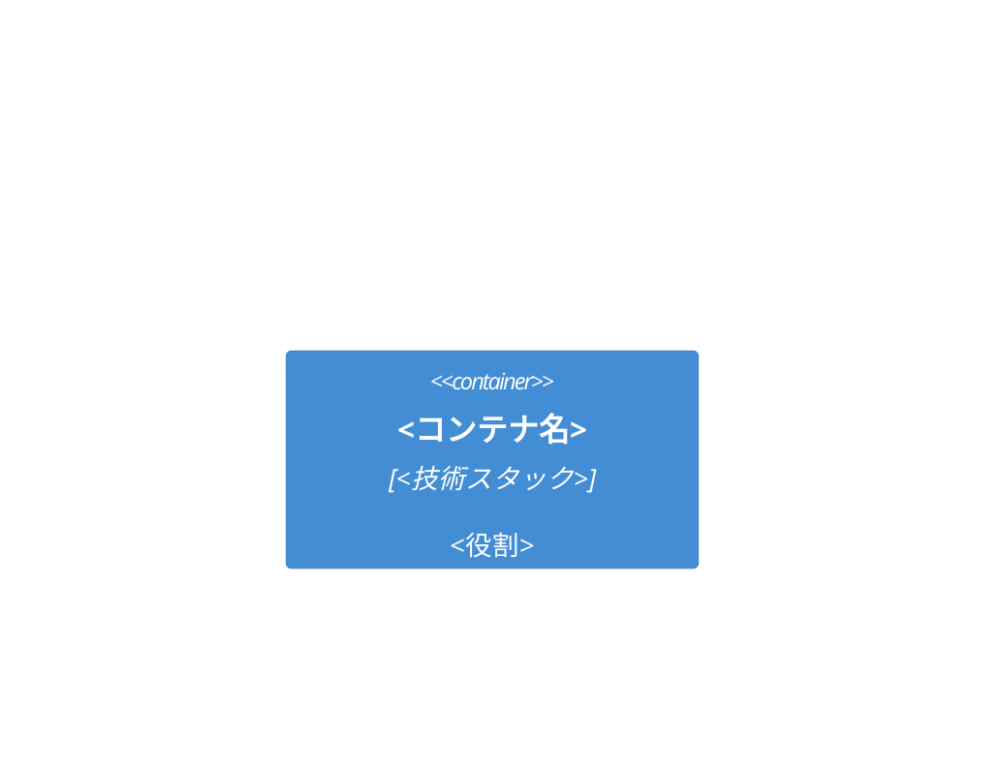

# <タイトル>

<!-- 設計メモで足りる規模なら、このテンプレートを使わず決定と理由を散文で書く -->
<!-- Status は合意プロセスを回す場合のみ: Draft / In Review / Approved / Obsolete -->

- 著者:
- 関連文書: <PRD、親 Design Doc、ADR>

<!-- ここから Mini Design Doc の必須節 -->

## 概要（Context and Scope）

<新規読者が前提知識ゼロで読める客観的な背景。3〜5 段落以内>

## 目標と非目標（Goals / Non-Goals）

### 目標

- <計測可能な目標。例: 検索 P95 を 800ms から 300ms にする>

### 非目標

- <合理的にあり得るが、あえてやらないこと>

## 設計（The Actual Design）

### システム構成図

### <トピック別サブセクション（API・データモデル・処理フロー等）>

<なぜこの設計にしたのか（トレードオフ）を必ず書く>

## 代替案（Alternatives Considered）

| 代替案 | 利点 | 欠点 | 不採用理由 |
|--------|------|------|-----------|
| <検討した案> | | | |

<!-- ここから下は Full Design Doc の候補節。該当する項目だけを残し、
     使わない節は見出しごと削除する。「該当なし」と書き残さない -->

## 横断的関心事（Cross-cutting Concerns）

<!-- 候補: セキュリティ / 権限 / プライバシー / 可観測性 / 運用 / コスト /
     データ保持 / 国際化。この設計判断に実際に影響するものだけを書く -->

## マイルストーン・移行計画

<段階的リリース、既存システムからの移行、ロールバック手段>

## 未解決の問題（Open Questions）

- <レビューで議論したい論点>
