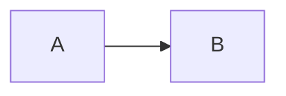

# Azure DevOps Wiki 固有の規約

`doc-writing/SKILL.md` の詳細ガイド。Wiki ページ（`references/wiki-guide.md`）を Azure DevOps Wiki に掲載する場合の、プラットフォーム固有の書式規約をまとめる。この規約は Azure DevOps Wiki ページに適用するものであり、リポジトリ内に Markdown ファイルとして管理する他の種別（Design Doc・ADR・README 等）には適用しない。

出典は [Markdown syntax for files, widgets, wikis](https://learn.microsoft.com/en-us/azure/devops/project/wiki/markdown-guidance) と [Add and edit wiki pages](https://learn.microsoft.com/en-us/azure/devops/project/wiki/add-edit-wiki)。

## 目次

目次が必要な場合は、手書きの目次を作らず `[[_TOC_]]` を置く。Wiki が見出し構成から自動生成する。

- 記法は大文字小文字を区別する。`[[_toc_]]` では描画されない
- ページ内に複数書いても、最初の 1 つだけが有効になる
- 位置は任意で、書いた場所に描画される。タイトル直後に置くのは慣例であって制約ではない

## 図（Mermaid）

Azure DevOps Wiki は次の 2 つの記法をどちらもサポートする。標準のコードフェンスが使えるため、リポジトリ内の Markdown と記法を揃えたい場合はそちらを選んでよい。

````text
::: mermaid
graph LR
    A --> B
:::
````

````text

````

### 構文サポートは限定的

Azure DevOps がサポートするのは Mermaid の一部である。**`flowchart` 構文は使えない。`graph` を使う。** Mermaid 本体のドキュメントや Live Editor で動く記法がそのまま通るとは限らないため、`flowchart` を含む例をそのまま持ち込まない。

その他の非サポート: 大半の HTML タグ、Font Awesome、LongArrow（`---->`）。

サポートされる図の種別は次の 11 種。

`sequenceDiagram` / `gantt` / `graph`（フローチャート）/ `classDiagram` / `stateDiagram` / `journey`（User Journey）/ `pie` / `requirementDiagram` / `gitGraph` / `erDiagram` / `timeline`

データフロー図・シーケンス図は、コードで管理できる Mermaid を画像より優先する。

## ページ名とパス

- ページ名はそのまま URL になる。**ページファイル名にスペースを使わない**。ページタイトルのスペースはファイル名ではハイフンに置き換える（例:「How to contribute」→ `How-to-contribute.md`）
- 使えない文字: スラッシュ `/`、バックスラッシュ `\`、ハッシュ `#`、名前の先頭または末尾のピリオド `.`、Unicode 制御文字・サロゲート文字
- コロン `:`、疑問符 `?`、アスタリスク `*`、パイプ `|`、山括弧 `<` `>`、二重引用符 `"`、ハイフン `-` は使える。URL では `%3A` `%3F` のようにエンコードされる
- 完全修飾パスは 235 文字以内に収める
- ページファイル名は大文字・小文字を区別し、同一フォルダ内で一意である必要がある
- ページファイルは 18 MB、添付ファイルは 19 MB が上限
- 親フォルダがサブフォルダのみでページファイルを持たない場合、ナビゲーションが空表示になる。親フォルダには最低限のページファイルを置く

## ページ内リンク

日本語見出しへのアンカーリンクは URL エンコードが不安定になりやすい。ページ内の特定の見出しへ直接リンクする構成に依存せず、`[[_TOC_]]` による目次で代替する。

ページを移動するとページ間リンクが壊れる。UI の **Move** から移動すると、影響を受けるリンクの更新を提案してくれるので、それを使う。

## 添付ファイル

添付ファイルは `.attachments` 配下に置かれる前提でパスを書く。
